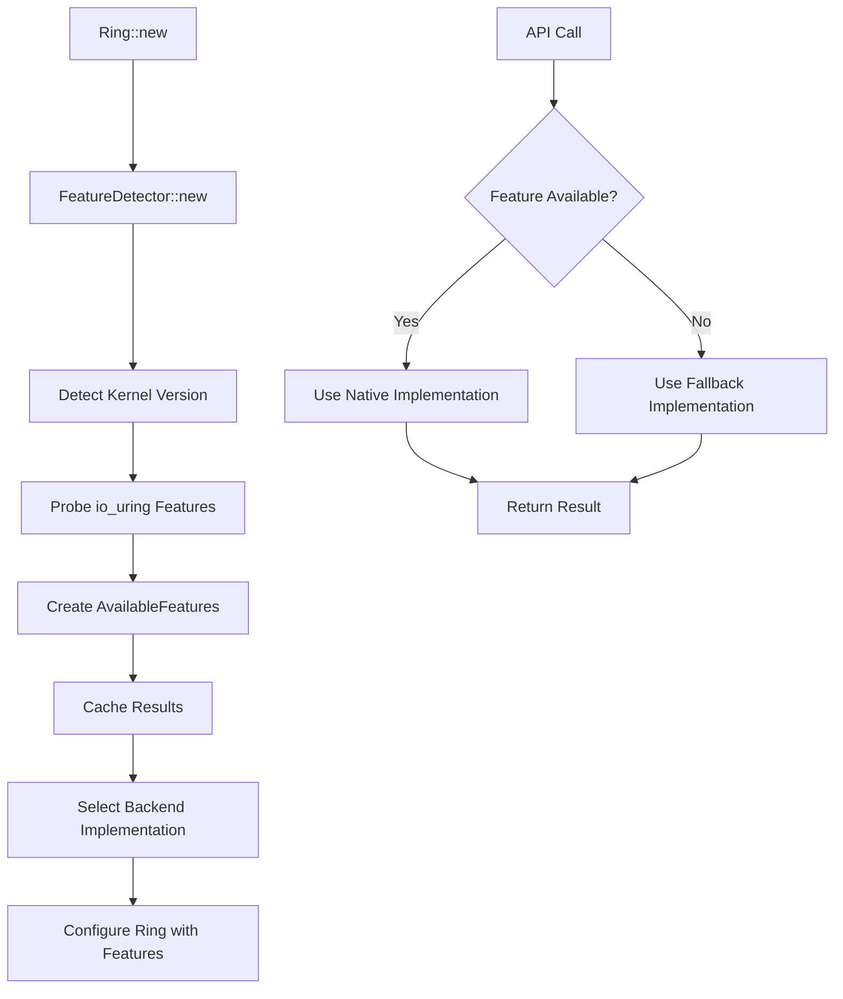

# Design Document

## Overview

The Progressive Enhancement system for safer-ring implements a sophisticated feature detection and fallback mechanism that allows the library to leverage cutting-edge kernel capabilities while maintaining broad compatibility. The design follows the principle of "progressive enhancement" where the core API works on minimum supported kernels, and newer features are exposed through enhanced methods that either leverage new kernel capabilities or provide graceful fallbacks.

The system uses runtime kernel detection, backend abstraction, and configuration-driven feature control to provide optimal performance on newer systems while ensuring reliability on older deployments. This approach allows safer-ring to evolve with the Linux kernel ecosystem without breaking existing applications.

## Architecture

### High-Level Architecture

```
┌─────────────────────────────────────────────────────────────────┐
│                        Application Layer                        │
│  ┌─────────────────┐  ┌─────────────────┐  ┌─────────────────┐ │
│  │ accept_multiple │  │ send_enhanced   │  │ recv_enhanced   │ │
│  │                 │  │                 │  │                 │ │
│  └─────────────────┘  └─────────────────┘  └─────────────────┘ │
└─────────────────────────────────────────────────────────────────┘
                                │
                                ▼
┌─────────────────────────────────────────────────────────────────┐
│                         Ring Layer                              │
│  ┌─────────────────────────────────────────────────────────────┐ │
│  │              Feature Detection & Selection                  │ │
│  │  ┌─────────────────┐  ┌─────────────────┐                  │ │
│  │  │ FeatureDetector │  │ AvailableFeatures│                  │ │
│  │  │                 │  │                 │                  │ │
│  │  └─────────────────┘  └─────────────────┘                  │ │
│  └─────────────────────────────────────────────────────────────┘ │
└─────────────────────────────────────────────────────────────────┘
                                │
                                ▼
┌─────────────────────────────────────────────────────────────────┐
│                       Backend Layer                             │
│  ┌─────────────────┐              ┌─────────────────┐           │
│  │ IoUringBackend  │              │  EpollBackend   │           │
│  │                 │              │                 │           │
│  │ • Native Impl   │              │ • Fallback Impl │           │
│  │ • Multi-shot    │              │ • Error Returns │           │
│  │ • MSG_RING      │              │ • Compatibility │           │
│  │ • Registered FD │              │                 │           │
│  └─────────────────┘              └─────────────────┘           │
└─────────────────────────────────────────────────────────────────┘
                                │
                                ▼
┌─────────────────────────────────────────────────────────────────┐
│                       Kernel Layer                              │
│  ┌─────────────────┐  ┌─────────────────┐  ┌─────────────────┐ │
│  │   Linux 5.1+    │  │   Linux 5.19+   │  │   Linux 6.11+   │ │
│  │                 │  │                 │  │                 │ │
│  │ • Basic io_uring│  │ • Multi-shot    │  │ • MSG_RING      │ │
│  │ • Single ops    │  │ • Buffer rings  │  │ • Enhanced perf │ │
│  └─────────────────┘  └─────────────────┘  └─────────────────┘ │
└─────────────────────────────────────────────────────────────────┘
```

### Feature Detection Flow



## Components and Interfaces

### FeatureDetector

The core component responsible for runtime feature detection:

```rust
pub struct FeatureDetector {
    kernel_version: KernelVersion,
    features: AvailableFeatures,
}

impl FeatureDetector {
    pub fn new() -> Result<Self> {
        let kernel_version = Self::detect_kernel_version()?;
        let features = Self::probe_features(&kernel_version)?;
        
        Ok(Self {
            kernel_version,
            features,
        })
    }
    
    fn detect_kernel_version() -> Result<KernelVersion> {
        // Parse /proc/version or use uname syscall
        // Return structured version information
    }
    
    fn probe_features(version: &KernelVersion) -> Result<AvailableFeatures> {
        // Probe specific io_uring capabilities
        // Test actual opcode availability
        // Return feature availability matrix
    }
}
```

**Key Responsibilities:**
- Detect running kernel version
- Probe available io_uring opcodes and features
- Cache detection results for performance
- Provide feature availability information

### AvailableFeatures

Structured representation of detected kernel capabilities:

```rust
pub struct AvailableFeatures {
    pub multi_shot_accept: bool,
    pub multi_shot_recv: bool,
    pub registered_ring_fd: bool,
    pub msg_ring_operations: bool,
    pub buffer_rings: bool,
    pub fixed_file_update: bool,
    pub kernel_version: KernelVersion,
}

impl AvailableFeatures {
    pub fn baseline() -> Self {
        // Return minimum feature set for Linux 5.1
        Self {
            multi_shot_accept: false,
            multi_shot_recv: false,
            registered_ring_fd: false,
            msg_ring_operations: false,
            buffer_rings: false,
            fixed_file_update: false,
            kernel_version: KernelVersion::new(5, 1, 0),
        }
    }
    
    pub fn supports_feature(&self, feature: Feature) -> bool {
        match feature {
            Feature::MultiShotAccept => self.multi_shot_accept,
            Feature::RegisteredRingFd => self.registered_ring_fd,
            Feature::MsgRingOps => self.msg_ring_operations,
            // ... other features
        }
    }
}
```

### Enhanced Backend Trait

Extended backend abstraction supporting progressive enhancement:

```rust
pub trait Backend {
    // Existing methods...
    fn submit_operation(&mut self, op: &Operation) -> Result<()>;
    fn try_complete(&mut self) -> Result<Option<Completion>>;
    
    // New progressive enhancement methods
    fn submit_accept_multi(&mut self, fd: RawFd, user_data: u64) -> Result<()>;
    fn submit_send_msg_ring(&mut self, fd: RawFd, buf: &[u8], user_data: u64) -> Result<()>;
    fn register_ring_fd(&mut self) -> Result<Option<RawFd>>;
    
    // Feature capability queries
    fn supports_feature(&self, feature: Feature) -> bool;
    fn get_feature_info(&self) -> &AvailableFeatures;
}
```

### IoUringBackend Implementation

Native high-performance implementations for newer kernels:

```rust
impl Backend for IoUringBackend {
    fn submit_accept_multi(&mut self, fd: RawFd, user_data: u64) -> Result<()> {
        if !self.features.multi_shot_accept {
            return Err(SaferRingError::UnsupportedFeature);
        }
        
        let entry = opcode::AcceptMulti::new(types::Fd(fd))
            .build()
            .user_data(user_data);
            
        unsafe {
            self.ring.submission()
                .push(&entry)
                .map_err(|e| SaferRingError::SubmissionFailed(e))?;
        }
        
        self.in_flight.insert(user_data, OperationType::AcceptMulti);
        self.ring.submit()?;
        Ok(())
    }
    
    fn register_ring_fd(&mut self) -> Result<Option<RawFd>> {
        if !self.features.registered_ring_fd {
            return Ok(None);
        }
        
        // Use IORING_REGISTER_RING_FDS to register the ring
        let ring_fd = self.ring.as_raw_fd();
        let ret = unsafe {
            libc::syscall(
                libc::SYS_io_uring_register,
                ring_fd,
                IORING_REGISTER_RING_FDS,
                &ring_fd as *const _ as *const libc::c_void,
                1,
            )
        };
        
        if ret < 0 {
            return Err(SaferRingError::RegistrationFailed);
        }
        
        Ok(Some(ring_fd))
    }
}
```

### EpollBackend Fallback Implementation

Compatibility implementations for older systems:

```rust
impl Backend for EpollBackend {
    fn submit_accept_multi(&mut self, _fd: RawFd, _user_data: u64) -> Result<()> {
        // Epoll doesn't support multi-shot operations
        Err(SaferRingError::UnsupportedFeature)
    }
    
    fn register_ring_fd(&mut self) -> Result<Option<RawFd>> {
        // Epoll doesn't have ring file descriptors
        Ok(None)
    }
    
    fn supports_feature(&self, _feature: Feature) -> bool {
        // Epoll backend provides baseline functionality only
        false
    }
}
```

### Enhanced Ring API

User-facing API that transparently uses the best available implementation:

```rust
impl<'ring> Ring<'ring> {
    pub fn new_with_detection() -> Result<Self> {
        let detector = FeatureDetector::new()?;
        let backend = Self::create_backend(&detector.features)?;
        
        Ok(Self {
            backend,
            features: Arc::new(detector.features),
            config: SaferRingConfig::default(),
        })
    }
    
    pub async fn accept_multiple(
        &mut self,
        fd: RawFd,
        max_connections: usize,
    ) -> Result<Vec<RawFd>> {
        if self.features.multi_shot_accept {
            // Use native multi-shot implementation
            self.accept_multiple_native(fd, max_connections).await
        } else {
            // Use userspace fallback loop
            self.accept_multiple_fallback(fd, max_connections).await
        }
    }
    
    async fn accept_multiple_native(
        &mut self,
        fd: RawFd,
        max_connections: usize,
    ) -> Result<Vec<RawFd>> {
        let user_data = self.next_user_data();
        self.backend.submit_accept_multi(fd, user_data)?;
        
        let mut connections = Vec::new();
        
        // Poll for multiple completions from single submission
        while connections.len() < max_connections {
            match self.poll_completion(user_data).await? {
                Some(completion) => {
                    if completion.result() >= 0 {
                        connections.push(completion.result() as RawFd);
                    } else {
                        // Error or EAGAIN - no more connections
                        break;
                    }
                }
                None => break,
            }
        }
        
        Ok(connections)
    }
    
    async fn accept_multiple_fallback(
        &mut self,
        fd: RawFd,
        max_connections: usize,
    ) -> Result<Vec<RawFd>> {
        let mut connections = Vec::new();
        
        // Userspace loop with timeout to avoid blocking
        for _ in 0..max_connections {
            match tokio::time::timeout(
                Duration::from_millis(10),
                self.accept_safe(fd)
            ).await {
                Ok(Ok(client_fd)) => connections.push(client_fd),
                _ => break, // Timeout or error - no more connections
            }
        }
        
        Ok(connections)
    }
}
```

## Data Models

### KernelVersion

Structured kernel version representation:

```rust
#[derive(Debug, Clone, PartialEq, Eq, PartialOrd, Ord)]
pub struct KernelVersion {
    pub major: u32,
    pub minor: u32,
    pub patch: u32,
}

impl KernelVersion {
    pub fn new(major: u32, minor: u32, patch: u32) -> Self {
        Self { major, minor, patch }
    }
    
    pub fn from_string(version_str: &str) -> Result<Self> {
        // Parse version string like "5.19.0" or "6.11.2-arch1-1"
        let parts: Vec<&str> = version_str
            .split(|c: char| c == '.' || c == '-')
            .collect();
            
        if parts.len() < 3 {
            return Err(SaferRingError::InvalidKernelVersion);
        }
        
        Ok(Self {
            major: parts[0].parse()?,
            minor: parts[1].parse()?,
            patch: parts[2].parse()?,
        })
    }
}
```

### Feature Enumeration

Comprehensive feature enumeration for easy management:

```rust
#[derive(Debug, Clone, Copy, PartialEq, Eq, Hash)]
pub enum Feature {
    MultiShotAccept,
    MultiShotRecv,
    RegisteredRingFd,
    MsgRingOperations,
    BufferRings,
    FixedFileUpdate,
    BatchedSubmissions,
    AsyncCancel,
}

impl Feature {
    pub fn required_kernel_version(&self) -> KernelVersion {
        match self {
            Feature::MultiShotAccept => KernelVersion::new(5, 19, 0),
            Feature::MultiShotRecv => KernelVersion::new(5, 19, 0),
            Feature::RegisteredRingFd => KernelVersion::new(6, 3, 0),
            Feature::MsgRingOperations => KernelVersion::new(6, 11, 0),
            Feature::BufferRings => KernelVersion::new(5, 19, 0),
            Feature::FixedFileUpdate => KernelVersion::new(5, 5, 0),
            Feature::BatchedSubmissions => KernelVersion::new(5, 1, 0),
            Feature::AsyncCancel => KernelVersion::new(5, 5, 0),
        }
    }
    
    pub fn description(&self) -> &'static str {
        match self {
            Feature::MultiShotAccept => "Multi-shot accept operations",
            Feature::RegisteredRingFd => "Registered ring file descriptors",
            Feature::MsgRingOperations => "MSG_RING enhanced operations",
            // ... other descriptions
        }
    }
}
```

### Configuration Integration

Enhanced configuration supporting feature control:

```rust
#[derive(Debug, Clone)]
pub struct ProgressiveEnhancementConfig {
    pub enable_multi_shot: Option<bool>,
    pub enable_registered_ring_fd: Option<bool>,
    pub enable_msg_ring: Option<bool>,
    pub fallback_timeout_ms: u64,
    pub feature_detection_cache: bool,
}

impl Default for ProgressiveEnhancementConfig {
    fn default() -> Self {
        Self {
            enable_multi_shot: None, // Auto-detect
            enable_registered_ring_fd: None, // Auto-detect
            enable_msg_ring: None, // Auto-detect
            fallback_timeout_ms: 10,
            feature_detection_cache: true,
        }
    }
}

impl ProgressiveEnhancementConfig {
    pub fn should_use_feature(&self, feature: Feature, available: bool) -> bool {
        let user_preference = match feature {
            Feature::MultiShotAccept => self.enable_multi_shot,
            Feature::RegisteredRingFd => self.enable_registered_ring_fd,
            Feature::MsgRingOperations => self.enable_msg_ring,
            _ => None,
        };
        
        match user_preference {
            Some(enabled) => enabled && available,
            None => available, // Auto-detect
        }
    }
}
```

## Error Handling

### Enhanced Error Types

Extended error handling for progressive enhancement:

```rust
#[derive(Debug, thiserror::Error)]
pub enum SaferRingError {
    // Existing errors...
    #[error("I/O error: {0}")]
    Io(#[from] std::io::Error),
    
    // New progressive enhancement errors
    #[error("Feature not supported by current kernel or backend")]
    UnsupportedFeature,
    
    #[error("Feature detection failed: {0}")]
    FeatureDetectionFailed(String),
    
    #[error("Invalid kernel version format")]
    InvalidKernelVersion,
    
    #[error("Backend registration failed")]
    RegistrationFailed,
    
    #[error("Fallback implementation failed: {0}")]
    FallbackFailed(String),
}
```

### Graceful Degradation Strategy

Comprehensive error handling and fallback logic:

```rust
impl<'ring> Ring<'ring> {
    async fn execute_with_fallback<T, F, Fallback>(
        &mut self,
        feature: Feature,
        native_impl: F,
        fallback_impl: Fallback,
    ) -> Result<T>
    where
        F: Future<Output = Result<T>>,
        Fallback: Future<Output = Result<T>>,
    {
        if self.should_use_feature(feature) {
            match native_impl.await {
                Ok(result) => {
                    log::debug!("Used native implementation for {:?}", feature);
                    Ok(result)
                }
                Err(SaferRingError::UnsupportedFeature) => {
                    log::warn!("Native implementation failed, falling back for {:?}", feature);
                    fallback_impl.await
                }
                Err(e) => Err(e),
            }
        } else {
            log::debug!("Using fallback implementation for {:?}", feature);
            fallback_impl.await
        }
    }
}
```

## Testing Strategy

### Feature Detection Testing

Comprehensive testing of feature detection logic:

```rust
#[cfg(test)]
mod tests {
    use super::*;
    
    #[test]
    fn test_kernel_version_parsing() {
        let version = KernelVersion::from_string("5.19.0").unwrap();
        assert_eq!(version, KernelVersion::new(5, 19, 0));
        
        let version = KernelVersion::from_string("6.11.2-arch1-1").unwrap();
        assert_eq!(version, KernelVersion::new(6, 11, 2));
    }
    
    #[test]
    fn test_feature_requirements() {
        assert_eq!(
            Feature::MultiShotAccept.required_kernel_version(),
            KernelVersion::new(5, 19, 0)
        );
        
        assert_eq!(
            Feature::RegisteredRingFd.required_kernel_version(),
            KernelVersion::new(6, 3, 0)
        );
    }
    
    #[tokio::test]
    async fn test_fallback_behavior() {
        let mut ring = Ring::new_with_detection().unwrap();
        
        // Test should work regardless of kernel version
        let connections = ring.accept_multiple(server_fd, 5).await.unwrap();
        assert!(connections.len() <= 5);
    }
}
```

### Mock Backend Testing

Testing with simulated kernel environments:

```rust
struct MockBackend {
    features: AvailableFeatures,
    fail_native: bool,
}

impl MockBackend {
    fn new_old_kernel() -> Self {
        Self {
            features: AvailableFeatures::baseline(),
            fail_native: false,
        }
    }
    
    fn new_modern_kernel() -> Self {
        Self {
            features: AvailableFeatures {
                multi_shot_accept: true,
                registered_ring_fd: true,
                msg_ring_operations: true,
                ..AvailableFeatures::baseline()
            },
            fail_native: false,
        }
    }
}

#[tokio::test]
async fn test_progressive_enhancement_with_mock() {
    let old_backend = MockBackend::new_old_kernel();
    let modern_backend = MockBackend::new_modern_kernel();
    
    // Test that both backends produce correct results
    // but modern backend uses enhanced features
}
```

## Performance Considerations

### Feature Detection Caching

Optimize feature detection performance:

```rust
lazy_static! {
    static ref CACHED_FEATURES: Mutex<Option<AvailableFeatures>> = Mutex::new(None);
}

impl FeatureDetector {
    pub fn get_cached_features() -> Result<AvailableFeatures> {
        let mut cache = CACHED_FEATURES.lock().unwrap();
        
        if let Some(ref features) = *cache {
            return Ok(features.clone());
        }
        
        let detector = Self::new()?;
        *cache = Some(detector.features.clone());
        Ok(detector.features)
    }
}
```

### Benchmark Integration

Performance measurement for progressive enhancement:

```rust
pub struct ProgressiveEnhancementBenchmark {
    native_times: Vec<Duration>,
    fallback_times: Vec<Duration>,
    feature: Feature,
}

impl ProgressiveEnhancementBenchmark {
    pub fn measure_enhancement_impact(&mut self, iterations: usize) -> BenchmarkResult {
        // Measure both native and fallback implementations
        // Calculate performance improvement percentages
        // Provide statistical analysis of the differences
        
        BenchmarkResult {
            native_avg: self.calculate_average(&self.native_times),
            fallback_avg: self.calculate_average(&self.fallback_times),
            improvement_percent: self.calculate_improvement(),
            confidence_interval: self.calculate_confidence_interval(),
        }
    }
}
```

This design provides a robust foundation for implementing progressive enhancement in safer-ring, allowing the library to leverage new kernel features while maintaining broad compatibility and providing clear performance benefits for users on modern systems.